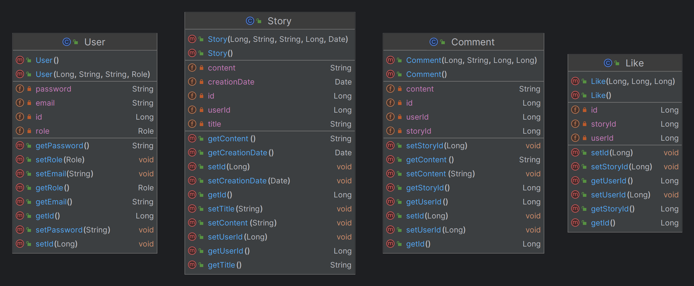

# Microfiction Service

The Microfiction service is a RESTful web service designed for writers to create, publish, and explore microfiction
stories. Microfiction, also known as flash fiction or short-short stories, is a genre of fiction characterized by its
brevity, typically consisting of narratives under 300 words.

## Key Features

- **User Management**: Create accounts, manage profiles, and connect with fellow writers.
- **Story Creation and Publication**: Write, edit, and publish microfiction stories with ease.
- **Social Interaction**: Like, comment on, and share stories to engage with other writers and readers.
- **Search and Discovery**: Explore a diverse collection of microfiction stories through advanced search and discovery
  features.
- **Security and Privacy**: Secure authentication and authorization mechanisms protect user data and ensure privacy.

## UML Class Diagram

The UML class diagram below illustrates the core entities of the service.

## Installation

1. Clone the repository: `git clone https://github.com/lynnemunini/micro-fiction-api.git`
2. Navigate to the project directory: `cd microfiction-api`
3. Start Docker Compose `docker-compose up`

## API Documentation

The API documentation is generated using Springdoc OpenAPI. After running the application, you can access the Swagger UI
at `http://localhost:8080/swagger-ui.html`. And the API docs at `http://localhost:8080/v3/api-docs`

## Tools and Dependencies

The service relies on the following tools and dependencies:

- **Docker**: *Docker compose* - Simplifies the orchestration of multi-container applications.
- **Spring Boot**: A powerful framework for building Java-based applications.
- **Spring Data JPA**: Provides easy access to data persistence in relational databases with Java Persistence API (JPA).
- **Spring Security**: Offers robust authentication and authorization features to secure the application.
- **Springdoc OpenAPI**: Generates API documentation using OpenAPI specifications, facilitating API exploration and
  integration.
- **MySQL**: A popular open-source relational database management system.
- **Hibernate**: An object-relational mapping (ORM) framework for mapping Java objects to database tables and vice
  versa.
- **Mockito & JUnit**: Used for testing purposes